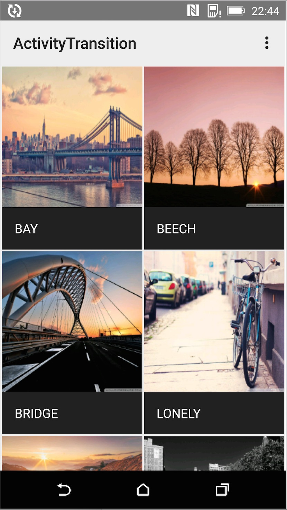
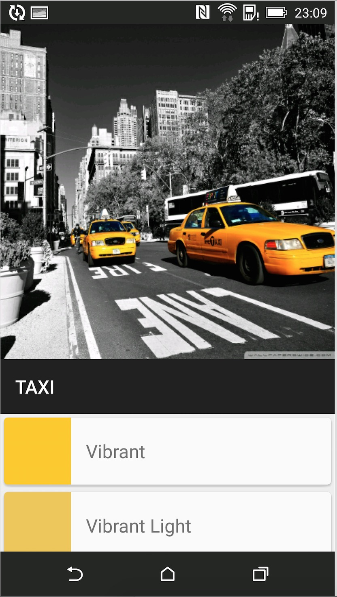
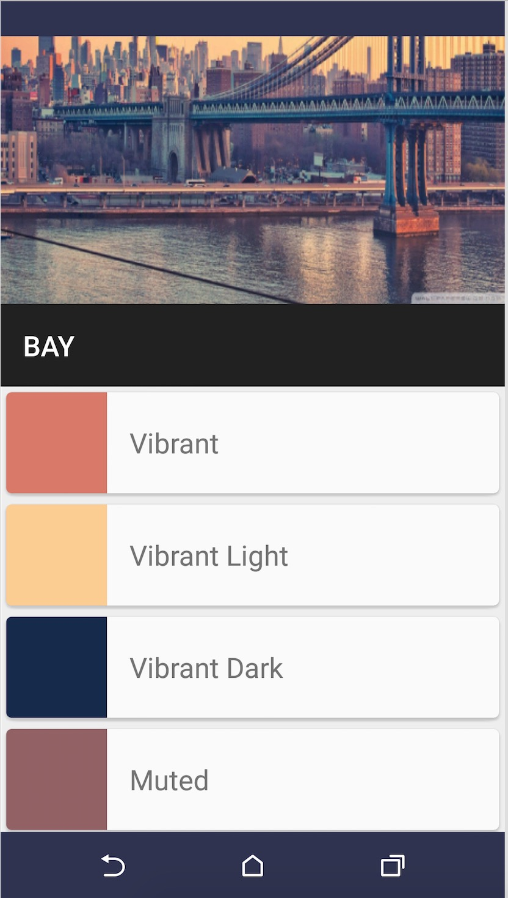

# Use Material Design

Material Design 是我很喜欢的设计风格，简约至上。去年 Google IO 推出之后，就已经了解了。但是一直没有怎么看 Android L 的 API。趁 Android M 推出这段时间，就试着去使用了下 Android 5.0。

[Material Design 中文版](http://design.1sters.com) 刚出来的时候，参与翻译了其中一章，算是国内最早的中文版吧。

看了 Android Training 里面的 Create App With Material Design，就写了一个简单的 Demo，不完整，但也涉及到了大部分常用的内容。


### Overview

+ **Material Theme**
+ **Activity Transition**
+ **RecyclerView & CardView**
+ **Palette**
+ **Ripple**

### Screenshot







### Material Theme

Material 的主题其实和 Holo 的类型差不多，有这样的：

`android:Theme.Material.Light`
`android:Theme.Material.Light.DarkActionBar`
`android:Theme.Material`

除了这个，还可以在 Theme 里面重写一些属性来定义状态栏、标题栏和一些控件的颜色。

```
<resources>
<!-- inherit from the material theme -->
<style name="AppTheme" parent="android:Theme.Material">
<!-- Main theme colors -->
<!--   your app branding color for the app bar -->
<item name="android:colorPrimary">@color/primary</item>
<!--   darker variant for the status bar and contextual app bars -->
<item name="android:colorPrimaryDark">@color/primary_dark</item>
<!--   theme UI controls like checkboxes and text fields -->
<item name="android:colorAccent">@color/accent</item>
</style>
</resources>

```

### Activity Transition

这里的 Translation 是 Shared Element。在主页（图1）的 GridView 点击 item 之后，图片和文字将会有放大的效果，直接连接下一个 Activity 里面的图片和文字。在详情页面（图2）点击返回之后，图片和文字又回缩回主页中。

实现这个效果需要 Android 5.0 以上的版本。

```
Intent intent = new Intent(MainActivity.this,DetialActivity.class);
intent.putExtra(DetialActivity.COLOR_INDEX,position);

ActivityOptionsCompat activityOptions = ActivityOptionsCompat.makeSceneTransitionAnimation(MainActivity.this,

new Pair<View, String>(view.findViewById(R.id.imageview_item),DetialActivity.DETIAL_IMAGE),
new Pair<View, String>(view.findViewById(R.id.textview_name),DetialActivity.DETIAL_NAME));

// Now we can start the Activity, providing the activity options as a bundle
ActivityCompat.startActivity(MainActivity.this, intent, activityOptions.toBundle());

```
主要用的是`makeSceneTransitionAnimation`这个方法，在 Pair 这个参数中是可以关联很多个数据的，这里之后图片和文字。

很重要的，要为每一个关联的 View 设定一个`TransitionName`，这里是`DETIAL_IMAGE`和`DETIAL_NAME`。

同样，在另外一个 Activity 里面需要为关联的 View 设置这个 Transition Name。

```
ViewCompat.setTransitionName(mHeaderImageView, DETIAL_IMAGE);
ViewCompat.setTransitionName(mHeaderTitle, DETIAL_NAME);

```
然后再让 View 显示就可以了。其实这里可以自定义各种`activityOptions`，来定义 Activity Transition 动画。

### RecyclerView & CardView

RecyclerView 就不再做介绍了，这里是和 CardView 一起使用的。在详情页（图2）下方的显示的就是。先来看 CardView。

```
<android.support.v7.widget.CardView
xmlns:card_view="http://schemas.android.com/apk/res-auto"
android:layout_width="match_parent"
android:layout_height="match_parent"
android:layout_margin="4dp"
card_view:cardCornerRadius="4dp">
</android.support.v7.widget.CardView>

```
CardView 还有很多属性，比如阴影。这里只用了`cardCornerRadius`来设置圆角。然后把需要显示的布局嵌套在 CardView 里面就行。

RecyclerView 相对 ListView 来说，比较大的一个变化就是多了一个`LayoutManager`。

```
layoutManager = new FullyLinearLayoutManager(this);
recyclerView.setLayoutManager(layoutManager);

```
这里的`FullyLinearLayoutManager`是继承的 LinearLayoutManager，因为 RecyclerView 和 ScrollView 有冲突。

```
public static class ViewHolder extends RecyclerView.ViewHolder {

private TextView tvColorName;
private ImageView imgColor;

public ViewHolder(View itemView) {
super(itemView);

tvColorName = (TextView)itemView.findViewById(R.id.item_tv);
imgColor = (ImageView)itemView.findViewById(R.id.item_img);
}
}

```
这个是 RecyclerView 的 ViewHolder，和 ListView 里面差不多。

继承`RecyclerView.Adapter`需要重写3个方法。

```
@Override
public ViewHolder onCreateViewHolder(ViewGroup parent, int viewType) {

return new ViewHolder(layoutInflater.from(context).inflate(R.layout.recycler_item,parent,false));
}

@Override
public void onBindViewHolder(ViewHolder holder, int position) {

final int index = position;

holder.tvColorName.setText(dataSet.get(position).getColorName());
holder.imgColor.setBackgroundColor(dataSet.get(position).getColorRes());

holder.tvColorName.setOnClickListener(new View.OnClickListener() {
@Override
public void onClick(View v) {

Message msg = new Message();
msg.arg1 = dataSet.get(index).getColorRes();
msg.what = DetialActivity.CHANGE_COLOR;
handler.sendMessage(msg);
}
});

}

@Override
public int getItemCount() {
return dataSet.size();
}

```
在`onCreateViewHolder `传入之前写的 ViewHolder，在`onBindViewHolder`中绑定数据。

### Palette

这个 Palette 是我相当喜欢的，能够获取到图像中的颜色数据。Android 5.0中还有一个`Clip Views`用来填充图片也不错。

在 RecyelerView 当中的数据就是用 Palette 获取的。

```
Palette.generateAsync(bitmap,new Palette.PaletteAsyncListener(){

@Override
public void onGenerated(Palette palette) {

//充满活力
Palette.Swatch vibrantSwatch = palette.getVibrantSwatch();
Palette.Swatch lightVibrantSwatch = palette.getLightVibrantSwatch();
Palette.Swatch paletteDarkVibrantSwatch = palette.getDarkVibrantSwatch();

//柔和
Palette.Swatch mutedSwatch = palette.getMutedSwatch();
Palette.Swatch darkMutedSwatch = palette.getDarkMutedSwatch();
Palette.Swatch lightMutedSwatch = palette.getLightMutedSwatch();
｝

```
一共获取了这几种颜色。是的，获取到的这些颜色是拿来更改状态栏或者标题栏的颜色。当然也可以是别的控件，主要目的是让整个 APP UI 更加统一。

```
Window window = getWindow();
window.setStatusBarColor(color);
window.setNavigationBarColor(color);

```

### Ripple

这个 Ripple 涟漪效果也是很不错的，有分为无界和有界的。这里也只是简单使用了下，在 RecyelerView 的 item 中，使用

```
android:background="?android:attr/selectableItemBackground"

```
更多使用方法可以在官网中查看。


当然，Android 5.0 不仅仅这些，这里是很小一部分，还有很重要动画，阴影等。Material Design 给我最大的印象就是它的动画效果很不错。

[原文 llzz.me](llzz.me)

